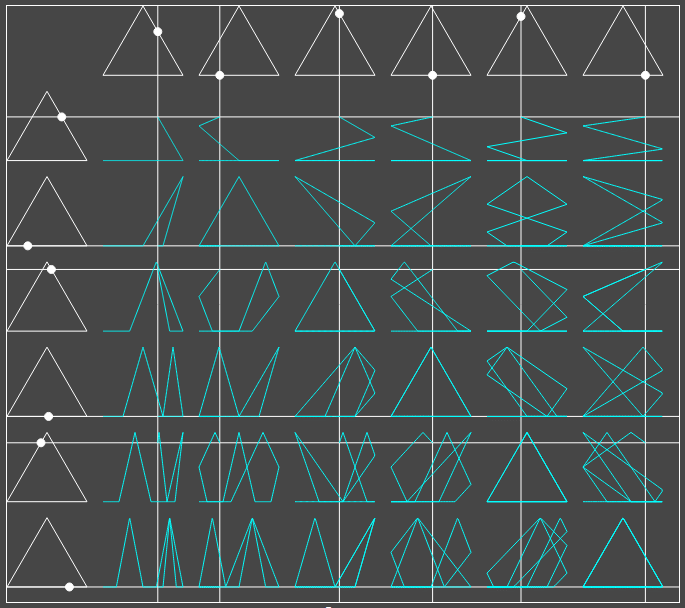

# Lissajous

Interactive canvas animations that draw Lissajous figures the way you'd construct them by hand.

Two variants: circles (true Lissajous curves) and triangles.

**[Circles](#)**

**[Triangles](#)**

Vanilla JavaScript and the Canvas 2D API, no dependencies. Open `circle/index.html` or `triangle/index.html` to run locally.